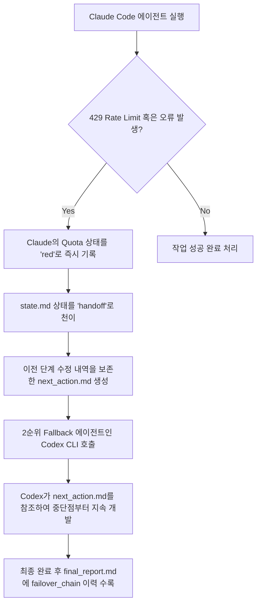

# AI Agent Orchestrator 사용자 매뉴얼

본 매뉴얼은 AI Agent Orchestrator 및 하네스(Harness) 시스템을 처음 접하는 형님(사용자)이 도구의 원리를 천천히 이해하고 안정적으로 시스템을 운영할 수 있도록 돕는 상세 매뉴얼입니다.

---

## 1. 이 도구는 무엇인가 (개요)
본 도구는 소프트웨어 개발 및 검증 작업을 자동화하기 위해 여러 AI Agent를 조율하는 **오케스트레이터(Orchestrator)**이자, 이들이 규칙을 어기지 않고 올바른 결과물을 내는지 시험하는 **하네스(Harness)** 시스템입니다.

- **작업 유형 자동 판단**: 사용자가 요구사항 한 줄만 입력하면 오케스트레이터가 인공지능을 통해 작업 유형(`task_type`)과 작업 가중치(`task_weight`)를 파악합니다.
- **적절한 Agent 라우팅**: 작업 유형에 맞춰 가장 성능이 좋고 현재 사용량이 여유로운 최적의 인공지능 에이전트(Claude, Codex, Antigravity)를 자동으로 선택하여 배정합니다.
- **자동 장애 극복 (Auto-Failover)**: 기본 에이전트가 실행 중 오류를 내거나 API 호출 한도(Usage/Rate Limit)로 막히면, 작업 진행 상태를 보존한 채 즉시 대체 에이전트(Codex)를 호출하여 이어서 작업을 수행하게 합니다.
- **다중 자동 검증**: 코딩이 완료되면 즉시 `pytest`(단위 테스트), `smoke test`(기능 작동 진단), `policy check`(금지 파일/경로 변경 감시), `final report check`(산출물 정합성 확인)를 차례로 실행해 사람이 확인하기 전에 자동으로 결함을 걸러냅니다.
- **시각적 보고서 단독 렌더링**: 검증이 끝나면 매우 가볍고 직관적인 요약본(`operation_summary.md`)과 상세 이력 보고서(`final_report.md`)를 남겨 복잡한 이력을 형님이 즉각 한눈에 파악할 수 있도록 돕습니다.

---

## 2. 전체 구조 이해하기
본 시스템은 오케스트레이터 코드가 존재하는 **공통 저장소**와 형님이 실제로 개발하고 수정하려는 **작업 대상 프로젝트**로 분리되어 유기적으로 맞물려 작동합니다.

```text
/home/mhhan/projects/
  ai-agent-orchestrator/   <--- [공통 실행 엔진 저장소]
    README.md
    .gitignore
    AGENTS.md
    AI_RULES.md
    VALIDATION.md
    orchestrator/
      run_task.py          <--- 오케스트레이터 메인 진입 스크립트
      router.py            <--- 에이전트 라우팅 담당 모듈
      task_classifier.py   <--- 태스크 분석 및 추론 모듈
      agent_status.yaml    <--- 에이전트들의 현재 차단(Quota) 상태 관리 DB
      policies/            <--- 금지 명령, 금지 파일 등 정형 정책 폴더
      runners/             <--- 각 에이전트 구동 쉘 스크립트 폴더
      templates/           <--- 보고서 및 안내 마크다운 템플릿 폴더
      validators/          <--- 테스트 및 정책 검증 도구 폴더
      docs/                <--- 공통 가이드 문서 폴더

  wt/
    260416-work/           <--- [실제 작업 대상 프로젝트 루트]
      .aiagent/            <--- 프로젝트 개별 연동 폴더 (새로 추가)
        project.yaml       <--- 공통 엔진과의 연동을 맺어주는 프로필 설정
        runs/              <--- 실행 마다 TASK_ID 별로 상세 로그가 쌓이는 폴더
```

### 디렉토리 역할 설명
1. **`ai-agent-orchestrator/`**: AI 코딩 에이전트를 안전하게 가두어놓고 관리하는 공통 관리 엔진입니다.
2. **`wt/260416-work/`**: 수급 보고서 등 형님이 실제로 일일 파이프라인을 운영하고 코드를 배포하는 본체 프로젝트입니다.
3. **`.aiagent/project.yaml`**: 이 파일이 작업 대상 프로젝트 루트에 존재해야 공통 엔진이 "어떤 파이썬 가상환경을 쓸지", "어떤 파일 수정을 금지할지"를 정확하게 파악하게 됩니다.
4. **`.aiagent/runs/`**: 에이전트가 실행한 덤프, 테스트 결과, 각종 진단 로그들이 임시로 생성되어 쌓이는 방입니다. `.gitignore`로 지정되어 커밋 대상에서는 완전 자동 제외됩니다.

---

## 3. 가장 먼저 알아야 할 핵심 개념 (초보자용 해설)
- **Orchestrator (오케스트레이터)**: 오케스트라 지휘자처럼 작업 지시를 받아 인공지능 에이전트를 소집하고 지휘, 검증, 보고 과정을 한 번에 관리하는 시스템 본체입니다.
- **Agent (에이전트)**: 지휘를 받아 실제로 코드를 고치거나 검토하는 등의 실무 노동을 수행하는 인공지능 주체입니다.
- **Claude Code (클로드 코드)**: 가장 코딩 능력이 뛰어나 코딩 관련 태스크에서 1순위로 배정받는 핵심(Primary) 개발 에이전트입니다.
- **Codex CLI (코덱스 CLI)**: 클로드가 사용량 한도 초과 등으로 작동 불능 상태가 되었을 때, 바통을 이어받아 남은 작업을 해결하는 2순위 대피용(Fallback) 에이전트입니다.
- **Antigravity CLI (안티그래비티 CLI)**: 개발은 하지 않고, 완성된 변경 건이 시스템 운영에 치명적인 문제를 일으키지 않는지 객관적으로 검토하는 리뷰 전용(Review-only) 에이전트입니다.
- **task_type (태스크 타입)**: 요구사항이 문서 수정인지(`documentation`), 테스트 오류 수정인지(`test_fix`), 코드 수정인지(`python_code_fix`) 등을 나눈 작업 분류입니다.
- **task_weight (태스크 가중치)**: 작업의 크기나 무거움에 따라 `light`(경미), `medium`(보통), `heavy`(대규모)로 등급을 나눈 무게입니다.
- **dry-run (드라이런/예행연습)**: 실제로 코드를 한 글자도 고치지 않고, 시스템이 어떤 에이전트를 골라 어떻게 일을 지시하고 프롬프트를 만드는지 "가상 시뮬레이션"만 해보는 매우 안전한 사전 테스트 모드입니다.
- **auto-run (오토런)**: 라우터 구동, 자동 Failover 대처, Antigravity 최종 리뷰 과정을 일일이 파라미터로 지정하지 않고 한 번에 묶어서 작동시켜 주는 통합 자동화 편리 옵션입니다.
- **failover (페일오버/장애 극복)**: 작동 중인 에이전트가 중단되거나 API 호출 한계(429)로 뻗어버렸을 때, 자동으로 다른 에이전트로 작업을 돌려 서비스 정지를 예방하는 튼튼한 안전장치입니다.
- **operation_summary.md (요약 보고서)**: 복잡한 로그를 보지 않고 형님이 단 5초 만에 `PASS`/`FAIL` 여부를 볼 수 있도록 설계된 한 장짜리 초압축 뷰어 파일입니다.
- **final_report.md (상세 보고서)**: 어떤 의사결정을 거쳐 에이전트가 선택되었고 변경된 파일과 테스트 결과는 어떠한지를 한눈에 확인하는 상세 로그 마크다운 파일입니다.
- **failure_report.md (실패 조치서)**: 작업이 최종적으로 멈추어 섰을 때 생성되며, "어떤 단계에서 왜 실패했는지"와 "복구를 위해 어떤 명령어를 터미널에 쳐야 하는지"를 친절히 안내하는 오류 해결서입니다.

---

## 4. 기본 실행 전 준비 (안전 검사)
작업에 임하기 전, 오케스트레이터와 대상 프로젝트 폴더가 정상적인 자리에 있는지 터미널 창에서 한 번씩 확인해 봅니다.

```bash
# 1) 공통 오케스트레이터 경로로 이동하여 상태 확인
cd /home/mhhan/projects/ai-agent-orchestrator
pwd
# 현재 위치가 /home/mhhan/projects/ai-agent-orchestrator 인지 확인
ls
# README.md 및 AGENTS.md, orchestrator/ 폴더가 보이는지 확인
git status --short
# 공통 레포지토리의 상태가 무결하고 깨끗한지 확인
```

> [!NOTE]
> 위의 조회 및 Read 명령들은 **사용자 승인 요청 없이 즉시 진행**이 가능한 안전 영역입니다.

```bash
# 2) 실제 작업 대상인 본체 프로젝트 경로로 이동하여 연결 확인
cd /home/mhhan/projects/wt/260416-work
pwd
# 현재 위치가 /home/mhhan/projects/wt/260416-work 인지 확인
ls -la .aiagent
# .aiagent 폴더와 그 아래 project.yaml 및 runs/ 폴더가 있는지 확인
cat .aiagent/project.yaml
# 연동 파일의 내용이 정상적으로 지정되어 있는지 확인
```

---

## 5. 가장 안전한 첫 실행: dry-run
본격적으로 인공지능이 내 코드를 만지게 하기 전에, 오케스트레이터가 내 요구사항을 어떤 식의 유형과 가중치로 판단하고 동작 계획을 짜는지 예행연습(`--dry-run`)을 돌려 봅니다.

```bash
# 공통 오케스트레이터 폴더로 이동합니다.
cd /home/mhhan/projects/ai-agent-orchestrator

# 가상환경 파이썬을 활용해 dry-run 모드로 태스크를 기동합니다.
/home/mhhan/projects/wt/260416-work/.venv/bin/python orchestrator/run_task.py \
  --project-root /home/mhhan/projects/wt/260416-work \
  --task-type auto \
  --auto-run \
  --dry-run \
  --requirement "README.md에 공통 AI Agent Orchestrator 사용법 섹션을 추가하라. README.md만 수정하라."
```

### 명령어 파라미터 뜯어보기
- **`/home/mhhan/projects/wt/260416-work/.venv/bin/python`**: 본체 프로젝트의 파이썬 인터프리터를 가져와 오케스트레이터를 돌립니다.
- **`--project-root`**: 변경을 진행할 본체 프로젝트 폴더의 절대 경로를 알려줍니다.
- **`--task-type auto`**: 내가 적어준 requirement 내용을 알아서 분류하여 최적의 Agent를 골라달라고 지시합니다.
- **`--auto-run`**: router 사용, Failover 조율, Antigravity final review 기동 옵션을 하나로 패키징해 구동합니다.
- **`--dry-run`**: **[매우 중요]** 가상 시뮬레이션 모드로 돌려 실제 파일을 변경하지 말라고 지시합니다.

---

## 6. dry-run 결과 확인 방법
dry-run이 끝나면 본체 프로젝트의 `.aiagent/runs/` 디렉토리에 고유한 TASK_ID 폴더가 생깁니다. 최신 폴더를 확인해 봅니다.

```bash
cd /home/mhhan/projects/wt/260416-work

# 가장 최근에 생성된 runs 폴더를 감지합니다.
LATEST_RUN=$(ls -1dt .aiagent/runs/*/ | head -1)
echo "$LATEST_RUN"
# 예: .aiagent/runs/260531-001/

# 초압축 요약 보고서인 operation_summary.md를 출력해 봅니다.
cat "$LATEST_RUN/operation_summary.md"
```

### 요약 보고서의 4가지 판정 상태 읽는 법
- **`PASS`**: 오케스트레이터의 가상 설계와 정책 확인에 전혀 결함이 없습니다. 실제 실행으로 바로 넘어가셔도 안전합니다.
- **`WARNING`**: 핵심 검증은 통과했으나 Antigravity independent review가 모종의 이유(러너 누락 등)로 실행되지 않아 경고가 남은 상태입니다.
- **`FAIL`**: 에이전트 지휘 과정에 모순이 발생했거나 정책 감사에서 치명적인 규칙 위반이 잡혀 거절된 상태입니다.
- **`NEEDS_HUMAN_REVIEW`**: 클로드와 코덱스가 모두 quota 차단(사용량 초과 등)으로 인해 코딩 작업을 이어갈 수 없어, Antigravity를 코딩 에이전트로 임의 강등 승격하지 않고 작동을 멈추고 형님의 처분을 기다리는 상태입니다.

---

## 7. 실제 실행 방법 (Real Run)
dry-run 결과 요약이 `PASS`로 검증되었다면, 이제 실제 에이전트를 호출하여 파일 수정을 가하는 실전 실행을 수행합니다.

```bash
cd /home/mhhan/projects/ai-agent-orchestrator

/home/mhhan/projects/wt/260416-work/.venv/bin/python orchestrator/run_task.py \
  --project-root /home/mhhan/projects/wt/260416-work \
  --task-type auto \
  --auto-run \
  --requirement "README.md에 공통 AI Agent Orchestrator 사용법 섹션을 추가하라. README.md만 수정하라."
```

실행이 끝나면 dry-run 절차와 동일하게 가장 최신의 `.aiagent/runs/*/operation_summary.md` 파일을 먼저 점검하여 작업이 완벽하게 완료되었는지 파악하십시오.

---

## 8. 결과 파일 설명 (어떤 파일을 언제 읽어야 하는가)
작업 디렉토리(`.aiagent/runs/{TASK_ID}/`)에 남는 산출물 파일의 쓰임새와 타이밍은 다음과 같습니다.

| 파일명 | 용도 및 설명 | 확인해야 하는 타이밍 |
| :--- | :--- | :--- |
| **`operation_summary.md`** | PASS/FAIL 판정 및 요약 결과를 담은 형님 전용 초간단 요약 보고서 | **작업 직후 가장 1순위로 확인** |
| **`final_report.md`** | 변경 파일 목록, 단위 테스트 요약, 정책 위반 체크 통과 등을 포함한 정밀 보고서 | PASS 판정 후 상세 작업 명세나 수정을 복기할 때 확인 |
| **`failure_report.md`** | 실패한 시점, 원인, 그리고 다시 기동하기 위한 터미널 명령어(rerun)를 제공하는 장애대비 해결서 | 요약 보고서 판정이 **FAIL** 또는 **NEEDS_HUMAN_REVIEW** 일 때 확인 |
| **`state.md`** | 에이전트의 구동 단계(initialized, handoff, completed)를 실시간 반영하는 작업 관리 대장 | 에이전트 간 바통을 터치하고 있을 때 실시간 진행 상태 조회용 |
| **`next_action.md`** | Claude가 뻗었을 때 Codex가 처음부터 다시 빌드하지 않도록 이전 단계 변경점과 주의사항을 바통 터치(Handoff)해 주는 문서 | Failover(장애 극복)가 일어나 다음 에이전트로 넘어가는 흐름을 디버깅할 때 확인 |
| **`agent_selection.log`** | 어떤 Quota 상태의 에이전트들이 라우팅 필터에 의해 배정되거나 탈락했는지 적는 이력로그 | 에이전트가 예상 외의 2순위로 선택되었거나 배정 불가 상태를 역추적할 때 확인 |
| **`task_classification.log`** | 사용자의 요구사항 문자열에서 어떤 키워드를 짚어내 유형과 무게를 추론했는지 적어두는 근거지 | 태스크 자동 분석이 엉뚱한 유형으로 판단되어 정정이 필요할 때 확인 |
| **`failover_chain.md`** | 에이전트 체인의 천이 이력(Claude 실패 -> Codex 대체 성공 여부 등)을 일목요연하게 묶은 상태 변경 보고서 | 에이전트 가동 체인의 복원 흐름을 한눈에 확인할 때 확인 |
| **`antigravity_review.md`** | Antigravity CLI가 3대 관점(적대적, 방어적, 복원력)에 입각하여 최종 판정한 마크다운 결과물 | 작업이 무결하게 검수 완료되었는지 안전장치 검사 이력을 볼 때 확인 |

---

## 9. 작업 유형 자동 판단 방식 (task_type 추론 규칙)
형님이 입력해 준 자연어 요구사항에 아래의 단어 패턴이 포함되어 있으면 오케스트레이터가 똑똑하게 타입을 결정합니다.

- **README, 문서, 설명, 가이드, md, markdown** 등 → **`documentation`** (문서화 작업)
- **pytest, 테스트 실패, test failed, 테스트 에러** 등 → **`test_fix`** (테스트 결함 복구)
- **버그, 오류, 예외, traceback, 실패, fix, 수정, 해결** 등 → **`python_code_fix`** (일반 파이썬 버그 수정)
- **리팩터링, 구조 개선, 모듈 분리, 코드 정리** 등 → **`refactor`** (리팩터링 작업)
- **전체 구조 검토, 대용량 코드베이스 분석** 등 → **`large_context_review`** (아키텍처 및 소스 진단)
- **리뷰, 검토, diff 검토, 최종 검토** 등 → **`final_review`** (검수 및 마감 확인)

> [!TIP]
> **작업 가중치(weight) 상향 조건**: 요구사항에 `전체`, `대규모`, `구조 변경`, `파이프라인`, `아키텍처`, `성능`, `장애 복구` 등의 명사가 발견되면 자동으로 무게가 **`heavy`**로 승격되어 노란색(Yellow) 주의 군의 에이전트 배정이 배제되는 안전장치가 작동합니다.

---

## 10. Agent 선택 방식 (라우터 작동 원리)
오케스트레이터는 에이전트들의 상태와 정책을 대조하여 지능적으로 배정합니다.

1. **Claude Code**가 1순위 primary 코딩 에이전트이며, 대다수의 코딩 태스크를 전담합니다.
2. **Codex CLI**는 클로드가 불가능할 때 비상 대피용으로 배정되는 fallback 에이전트입니다.
3. **Antigravity CLI**는 어떠한 경우에도 primary 코딩 에이전트로 승격 배정되지 않습니다. 오직 검수 및 독립 리뷰(`review_only`) 목적의 `final_review`나 `large_context_review` 단계에서만 메인으로 배정됩니다.
4. 만약 Claude와 Codex가 전부 rate limit(레드 상태) 혹은 명령 미설치(블랙 상태)로 뻗어 버리면, Antigravity를 코딩 용도로 강제 전용하지 않고 안전하게 차단하며 즉시 `Needs Human Review`로 정지하여 시스템 안전성을 극대화합니다.

---

## 11. 사용량 제한이 걸렸을 때 (Failover 흐름도)
Claude API 사용 한도 초과(429 에러 등) 발생 시의 안전 복구 절차는 다음과 같이 매끄럽게 처리됩니다.



---

## 12. 형님이 주로 볼 것 (우선순위 가이드)
바쁘신 형님이 한눈에 판정을 검수할 수 있도록 우선순위를 지정해 두었습니다.

1. **`1순위: operation_summary.md`**: 합격 상태(`PASS`/`FAIL` 등)와 '형님이 볼 것'을 확인해 이상이 없으면 그대로 종료하시면 됩니다.
2. **`2순위: final_report.md`**: 작업이 정상적으로 수행되었는데 "어떤 파일이 수정되었고 단위 테스트가 정말 다 성공했는지" 세부 내역이 궁금할 때 열어봅니다.
3. **`3순위: failure_report.md`**: 요약본에 `FAIL` 또는 `NEEDS_HUMAN_REVIEW`가 떴을 때만 열어서 재실행 가이드를 복사하여 수행하면 됩니다.

---

## 13. 안전 수칙 (승인 정책 요약)
의도하지 않은 명령어로 프로젝트 데이터나 데이터베이스가 파괴되는 사고를 막기 위해 승인 경계를 명확히 분리하여 운영합니다.

### A. 승인 없이 즉시 진행 가능한 작업 (Read 및 경미한 수정)
- 파일/경로 상태 및 로그 조회: `pwd`, `ls`, `find`, `grep`, `cat`
- 형상 및 버전 이력 조회: `git status`, `git diff`, `git log`
- 각 에이전트 Quota 상태 조회 및 마크다운 규칙 문서의 경미한 수정
- 공통 오케스트레이터 run 결과 로그 및 디렉토리 생성
- 자동 검증 명령 실행 (`pytest.sh`, `smoke_report.sh` 호출 등)

### B. 사용자(형님)의 명시적 승인이 필요한 작업 (위험 명령)
- 민감 설정 변조: `.env` 파일의 수정 및 재생성
- 핵심 데이터베이스 변조: `analysis.db` 임의 삭제 및 쿼리 수정
- 형상 파괴 및 초기화: `git reset --hard`, `git clean -fdx`
- 디렉토리 영구 삭제: `rm`, `rm -rf`, `find -delete`
- 시스템 권한 조작: `sudo`, `chmod -R 777`
- 원격 동기화 및 병합: `git commit`, `git push`, `git merge`
- 패키지 및 소프트웨어 라이브러리 임의 설치/갱신

---

## 14. 리뷰·검토 3대 관점 (진단 프레임워크)
모든 에이전트는 작업을 마무리할 때 아래 3가지 관점으로 변경 사항을 철저히 교차 검토합니다.

1. **적대적 관점 (Red Teaming)**
   - 설계상의 취약점이나 보안 우회 경로가 남아 있는지 감시합니다.
   - 인프라 에러 신호나 가상 Quota를 속여 검증을 우회하려는 위험한 가정이 있는지 진단합니다.
2. **예외 방어적 관점 (Negative Testing / Review)**
   - 변수가 `Null`이거나 `None`일 때 발생하는 터미널 traceback 오류를 예방합니다.
   - 타입 불일치(Type Mismatch), 0 나누기(Zero Division), 특정 파일 부재 시 대처 로직을 보완합니다.
3. **복원력 관점 (Stress Testing & Resilience Review)**
   - 에이전트 간의 교체(handoff) 시 파일 상태가 지워지지 않고 보존되는지 평가합니다.
   - 반복 실행이나 중단점 재실행 시 디바이스나 디스크 로그 용량이 누적되어 크래시를 유발하는지 확인합니다.

---

## 15. 자주 쓰는 명령 모음 (상황별 레시피)
형님이 개발 중에 흔히 마주하는 명령 레시피입니다.

### A. 문서 수정 (예: README 및 문서의 보완 작업)
```bash
/home/mhhan/projects/wt/260416-work/.venv/bin/python orchestrator/run_task.py \
  --project-root /home/mhhan/projects/wt/260416-work \
  --task-type auto \
  --auto-run \
  --requirement "README.md에 하네스 승인 정책 목록을 보완하라."
```

### B. 테스트 실패 수정 (예: pytest 실패 감지 시)
```bash
/home/mhhan/projects/wt/260416-work/.venv/bin/python orchestrator/run_task.py \
  --project-root /home/mhhan/projects/wt/260416-work \
  --task-type auto \
  --auto-run \
  --requirement "pytest 실패 로그를 분석하여 conftest.py의 경로 오류를 수정하라."
```

### C. 최신 실행 상태 한눈에 조회하기
```bash
cd /home/mhhan/projects/wt/260416-work
cat $(ls -1dt .aiagent/runs/*/ | head -1)/operation_summary.md
```

---

## 16. 실패했을 때 대처 (트러블슈팅 절차)
작업 검증 과정에서 `FAIL` 혹은 `NEEDS_HUMAN_REVIEW` 등의 에러가 발생한 경우, 다음 단계에 맞춰 침착하게 극복하십시오.

1. **`1단계: operation_summary.md` 확인**: 최종 판정과 '형님이 볼 것'을 보고 어떤 에이전트나 테스트가 주저앉았는지 인지합니다.
2. **`2단계: failure_report.md` 확인**: 실패 조치서 하단의 **Recommended Rerun Command (재실행 권장 명령)** 또는 **다음에 붙여넣을 요약 로그**를 살펴봅니다.
3. **`3단계: 에이전트 쿨다운 리셋`**: Claude나 Codex가 Rate Limit으로 뻗어서 `red` 상태가 된 것이 원인이라면, 조치서에 기재된 리셋 명령어(`--reset-agent-state claude_code=green`) 옵션을 붙여 재가동 명령을 보냅니다.
4. **`4단계: 체티(Cheeti)에게 전달`**: 복잡한 환경 에러나 인프라 파괴가 지속되는 경우에는, 요약 로그와 조치서 내용을 그대로 긁어 체티에게 넘겨 조치를 구하십시오.
5. **`절대 금지`**: 당황하여 `git reset --hard`나 `rm -rf` 같은 파괴적인 복구 명령을 독단적으로 실행해서는 안 됩니다.

---

## 17. GitHub repo 관리 규칙
- **독립 보존**: `ai-agent-orchestrator`는 공통 모듈이므로, 작업 대상 본체 프로젝트의 형상과 완전히 격리해서 GitHub Private 저장소로 관리해야 합니다.
- **연동 최소화**: 본체 프로젝트에는 오직 `.aiagent/project.yaml`과 비어 있는 `.aiagent/runs/` 뼈대 폴더만 올려 가볍게 유지하고 무거운 엔진 코드는 올리지 않는 규칙을 따릅니다.
- **수정 위치**: 오케스트레이터의 소스 및 검증기 로직을 수정 및 개선할 때는 반드시 `/home/mhhan/projects/ai-agent-orchestrator` 내의 파일들을 편집하여 커밋해야 합니다.

---

## 18. 권장 운영 루틴
안전하고 무결한 소프트웨어 배포를 위한 일일 표준 권장 순서입니다.

```text
[요구사항 작성] 
      ↓
[1단계: dry-run 가상 점검 실행] 
      ↓
[2단계: operation_summary.md로 PASS 판정 확인] 
      ↓
[3단계: 실전 실행 기동] 
      ↓
[4단계: pytest & Antigravity review 마감 판정 확인 후 작업 완료]
```
이 4단계 표준 운영 체계를 준수하면, 복잡한 인공지능 제어 과정에서도 한 번의 버그 없이 안전하게 파이프라인 품질을 보증할 수 있습니다.
